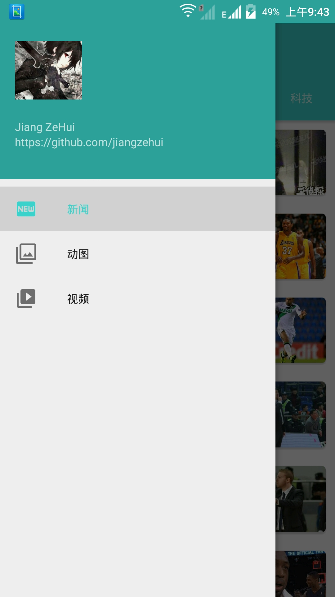
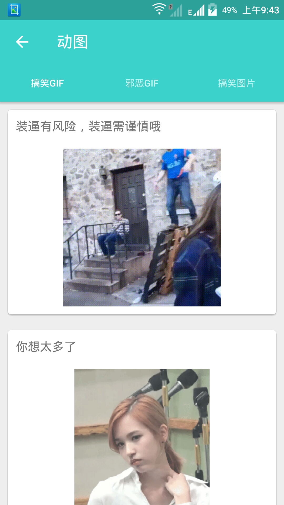
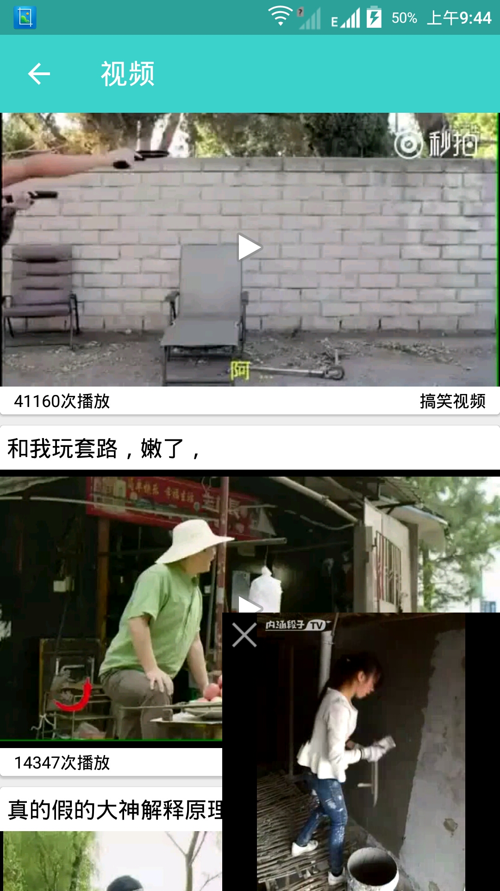
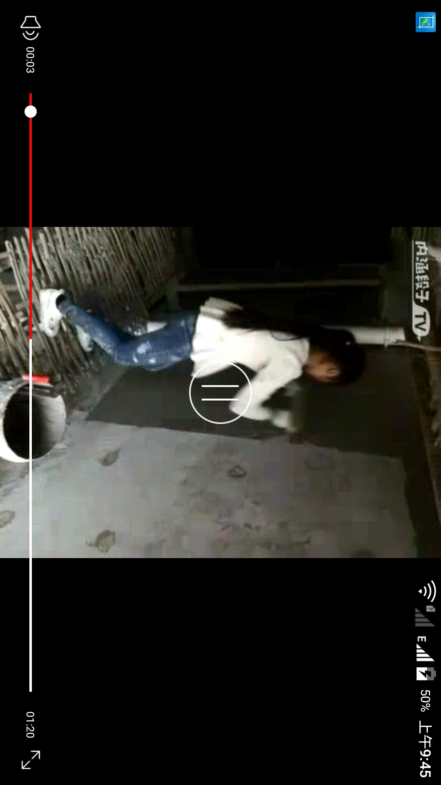

# MD
 
此项目基于Retrotfit2.1+Material Design+ijkplayer开发的一个APP。 
主要目的还是为了练习框架的使用。 
目前已有的功能是 新闻，gif动图，视频播放。 
此项目仅供学习用途 

#数据来源
新闻  直接用的聚合数据提供的接口 
gif动图  通过jsoup爬的某个网页上的数据 
视频  通过fiddler抓包某个APP的接口 

#项目效果图
PNG
 
 

 

 

 
GIF
 
 
 

#APK
[apk下载](https://www.pgyer.com/lianxiapp) gif动图有福利哦~~哈哈 

#用到的三方库

###注解
https://github.com/JakeWharton/butterknife 

###网络请求
https://github.com/square/retrofit  

###图片处理
https://github.com/bumptech/glide  
https://github.com/chrisbanes/PhotoView 

###数据抓取
https://jsoup.org/download 

###视频播放
https://github.com/Bilibili/ijkplayer 

#感谢
1.聚合数据 https://www.juhe.cn/ 
2.ijkplayer参考了 https://github.com/w1123440793/VideoListDemo 
#推荐阅读
1.模仿掌上英雄联盟能力分析效果  https://github.com/jiangzehui/polygonsview  

2.开源一个自己去年写的基于Xmpp协议的即时通讯社交软件 (客户端+服务端)  https://github.com/jiangzehui/xmpp  

#如果你觉得还不错，可以给个star，支持下，谢谢了！ 

#About me

An android little developer in HeBei. 
If you have any suggestions, let me know. 
email:jianghui1992@vip.qq.com

 
#License

Copyright 2016 jiangzehui

Licensed under the Apache License, Version 2.0 (the "License"); you may not use this file except in compliance with the License. You may obtain a copy of the License at

http://www.apache.org/licenses/LICENSE-2.0

Unless required by applicable law or agreed to in writing, software distributed under the License is distributed on an "AS IS" BASIS, WITHOUT WARRANTIES OR CONDITIONS OF ANY KIND, either express or implied. See the License for the specific language governing permissions and limitations under the License.
